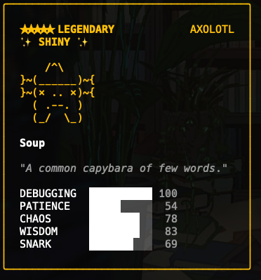

# Claude Buddy Lab

**Search, preview, and apply custom buddies to Claude Code — with binary patching.**

**搜索、预览并应用自定义 Claude Code 伙伴 - 通过二进制修补实现。**

<p align="center">
  
</p>

## Features / 功能

- **Binary Patching / 二进制修补** — Directly patches the Claude Code binary to apply your chosen buddy. No config hacks.
- **Search Engine / 搜索引擎** — Brute-force search through hundreds of thousands of salts to find the buddy you want.
- **Live Preview / 实时预览** — ASCII sprite, stats, rarity, shiny status — all visible before you apply.
- **One-Click Apply / 一键应用** — Apply directly from the web UI. Original salt is recorded for easy restoration.
- **Bilingual UI / 中英双语** — Auto-detects browser language. Supports English and Chinese.
- **Restore / 恢复** — Recorded original salt lets you revert to default at any time via `/api/restore`.

## Screenshots / 截图

| Web UI | Search Results | In Claude Code |
|:---:|:---:|:---:|
|  |  |  |

## Quick Start / 快速开始

```bash
git clone https://github.com/anYuJia/claude-buddy-lab.git
cd claude-buddy-lab
pip3 install flask

# Start web UI / 启动 Web 界面
python3 cli.py web --open
```

Open http://127.0.0.1:8080 — search for your dream buddy, preview it, and click **Apply**.

打开 http://127.0.0.1:8080 — 搜索你想要的伙伴，预览后点击 **应用**。

## CLI Usage / 命令行用法

```bash
# Preview current buddy / 预览当前伙伴
python3 cli.py preview

# Preview with specific salt / 使用指定 salt 预览
python3 cli.py preview --salt lab-00000294809

# Search: legendary axolotl / 搜索传说蝾螈
python3 cli.py search --species axolotl --rarity legendary --total 500000

# Search: shiny buddy / 搜索闪光伙伴
python3 cli.py search --shiny --total 1000000

# Search with min stat / 搜索指定最低属性
python3 cli.py search --species dragon --min-stat CHAOS:80
```

### CLI Options / 命令行参数

| Option | Description / 说明 |
|--------|-------------------|
| `--species` | Filter by species / 按物种筛选 (duck, cat, dragon, axolotl, capybara...) |
| `--rarity` | Filter by rarity / 按稀有度筛选 (common, uncommon, rare, epic, legendary) |
| `--eye` | Filter by eye type / 按眼睛筛选 (·, ✦, ×, ◉, @, °) |
| `--hat` | Filter by hat / 按帽子筛选 (crown, tophat, wizard, halo...) |
| `--shiny` | Shiny only / 仅闪光 (1% chance) |
| `--min-stat` | Min stat threshold / 最低属性 (e.g. `CHAOS:80`) |
| `--total` | Search attempts / 搜索次数 (default: 100000) |

## How It Works / 工作原理

Claude Code's buddy system uses a **salt string hardcoded in the binary** (`friend-2026-401`, 15 chars). The buddy's species, rarity, eyes, hat, and stats are all deterministically derived from `hash(userId + salt)`.

Claude Code 的伙伴系统使用**硬编码在二进制文件中的 salt 字符串**（`friend-2026-401`，15 字符）。伙伴的物种、稀有度、眼睛、帽子和属性全部由 `hash(userId + salt)` 确定性生成。

This tool:
1. **Searches** millions of salt values to find one that produces your desired buddy
2. **Patches** the Claude Code binary — replaces the old salt bytes with the new one (same length)
3. **Re-signs** the binary on macOS (`codesign --force --sign -`)
4. **Records** the original salt to `~/.claude-buddy-lab.json` for restoration

本工具：
1. **搜索**数百万个 salt 值，找到能生成你想要的伙伴的那个
2. **修补** Claude Code 二进制文件 — 用新 salt 替换旧的（等长替换）
3. 在 macOS 上**重新签名**（`codesign --force --sign -`）
4. **记录**原始 salt 到 `~/.claude-buddy-lab.json` 以便恢复

## API Endpoints

| Method | Endpoint | Description |
|--------|----------|-------------|
| GET | `/api/meta` | Metadata: species, rarities, binary status |
| GET | `/api/binary` | Current binary salt detection |
| POST | `/api/preview` | Preview buddy for given userId + salt |
| POST | `/api/search` | Search salts with filters |
| POST | `/api/apply` | Patch binary with new salt |
| POST | `/api/restore` | Restore original salt |

## Requirements / 依赖

- Python 3.8+
- Flask: `pip3 install flask`
- Claude Code (installed via npm)

## Project Structure / 项目结构

```
claude-buddy-lab/
├── cli.py           # Core logic + web server / 核心逻辑 + Web 服务
├── public/
│   └── index.html   # Web UI (bilingual) / Web 界面（双语）
├── img/             # Screenshots / 截图
└── README.md
```

## License

MIT
